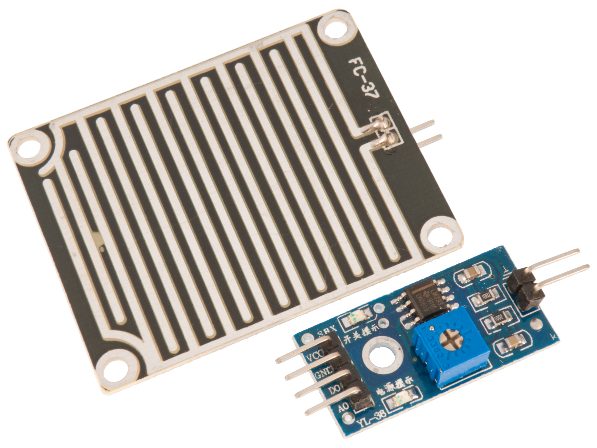
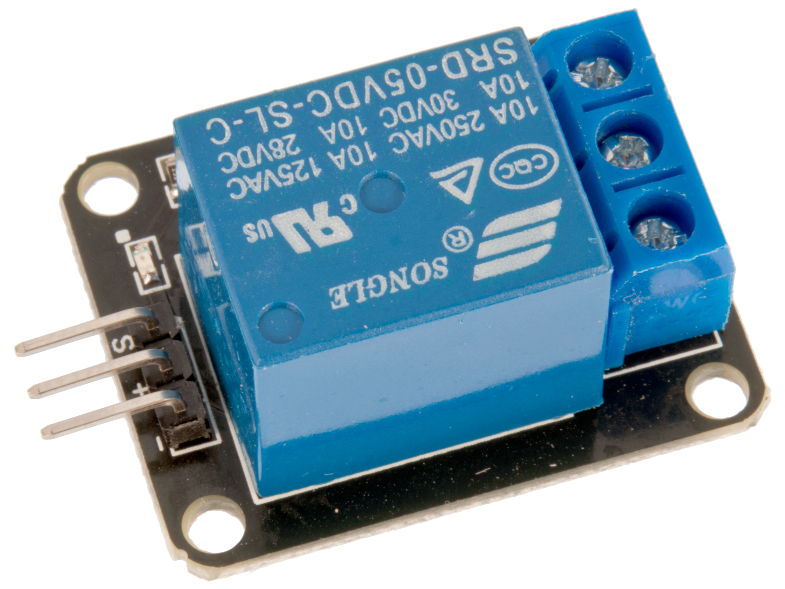
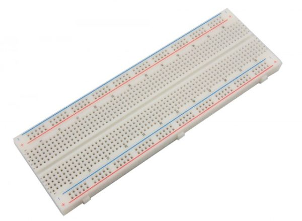
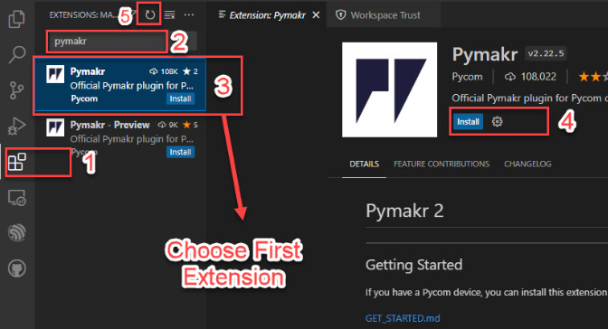

<h1 align="center">Smart Horticulture</h1>

<p align="center">
  
</p>

<p align="center">
  By: <a href="https://github.com/Aleij">Olle Jönsson</a> - Student ID: XX666X
</p>

## Project Overview

The Smart Horticulture project aims to build a system for monitoring temperature, humidity, rainfall, and motion in a horticulture environment. The project utilizes the Raspberry Pi Pico WH microcontroller along with a temperature and humidity sensor, a rain sensor, and a PIR motion sensor. The collected data provides insights into the environmental conditions and helps optimize plant growth and care.

## Objective

The main objective of the Smart Horticulture project is to create an automated monitoring system for horticulture environments. By utilizing sensors to collect data on temperature, humidity, rainfall, and motion, we aim to achieve the following:

- Monitor and maintain optimal environmental conditions for plant growth
- Detect and respond to changes in environmental parameters
- Provide insights for better plant care and resource management

## Materials

List of materials used in the project:

| Component                                 | Description                            | Purchase Link                                                        | Price ($) |
|-------------------------------------------|----------------------------------------|----------------------------------------------------------------------|-----------|
|  | Raspberry Pi Pico WH                   | [Link](https://www.electrokit.com/produkt/raspberry-pi-pico-wh/)                                  | 109 SEK   |
|    | DHT11 Temperature and Humidity Sensor   | [Link](https://www.electrokit.com/produkt/digital-temperatur-och-fuktsensor-dht11/)                              | 49 SEK  |
|   | Rain Sensor                            | [Link](https://www.electrokit.com/produkt/regnsensor/)                               | 39 SEK         |
|     | PIR (Passive Infrared) Motion Sensor    | [Link](https://www.electrokit.com/produkt/pir-rorelsedetektor-hc-sr501/)                                | 49 SEK         |
|     | Relay module 3.3V (5V)    | [Link](https://www.electrokit.com/produkt/relamodul-5v/)                                | 39 SEK         |
|     | Jumper Wire Male to Female    | [Link](https://www.electrokit.com/produkt/labbsladd-20-pin-15cm-hona-hane/)                                | 29 SEK         |
|     | Breadboard    | [Link](https://www.electrokit.com/produkt-kategori/kretskort-2/kopplingsdack-2/)                                | 69 SEK         |
|     | Jumper Wire Male to Male    | [Link](https://www.electrokit.com/produkt/labbsladd-20-pin-15cm-hane-hane/)                                | 29 SEK         |
|     | Jumper Wire Male to Female    | [Link](https://www.electrokit.com/produkt/labbsladd-20-pin-15cm-hona-hane/)                                | 29 SEK         |

## Computer Setup

## Programming the Raspberry Pi Pico WH Microcontroller

To program the Raspberry Pi Pico WH microcontroller on a Windows computer using Visual Studio Code, follow these steps:

1. **Flash the MicroPython firmware onto the Raspberry Pi Pico WH.**

   - Download the latest MicroPython firmware for Raspberry Pi Pico from the official [website](https://micropython.org/download/rp2-pico-w/).
   - Press and hold the BOOTSEL button on the Raspberry Pi Pico WH.
   - While holding the BOOTSEL button, connect the Raspberry Pi Pico WH to your computer using a USB cable.
   - The Raspberry Pi Pico WH will now appear as a mass storage device on your computer.
   - Copy the downloaded firmware (.uf2 file) and paste it into the mass storage device (Raspberry Pi Pico WH).

2. **Install Visual Studio Code.**

   - Download Visual Studio Code from the official website.
   - Run the installer and follow the on-screen instructions to complete the installation.

   

3. **Install the necessary extensions for MicroPython development in Visual Studio Code.**

   - Launch Visual Studio Code.
   - Open the Extensions view by clicking on the square icon on the left sidebar or by pressing `Ctrl+Shift+X`.
   - Search for the following extensions and install them:
   
     - MicroPython by Microsoft
     - PyMakr by Pycom

   

4. **Connect the Raspberry Pi Pico WH to your computer using a USB cable.**

   - Take a USB cable and connect one end to the USB port on your computer and the other end to the USB port on the Raspberry Pi Pico WH.
   - Ensure that the cable is securely connected to both devices.

   

5. **Upload the code to the microcontroller and ensure proper communication is established.**

   - Open the project folder in Visual Studio Code.
   - Write or open your code file in Visual Studio Code.
   - Click on the "Run" button in the top toolbar or use the keyboard shortcut `Ctrl+F5` to upload the code to the microcontroller.
   - Check the output in the terminal or output window to verify successful communication.

   


## Ubuntu Server Setup

To set up the Ubuntu server for running Mosquitto MQTT protocol and Node-RED, follow these steps:

1. Install Ubuntu Server on your old laptop or a dedicated machine.
2. Install Mosquitto MQTT broker on the Ubuntu server for communication between devices.
3. Install Node-RED on the Ubuntu server for building the user interface and data flow management.
4. Configure Mosquitto MQTT and Node-RED to communicate with the Raspberry Pi Pico WH and other devices.
5. Ensure that the Ubuntu server is connected to the same network as the Raspberry Pi Pico WH.

## Data Transmission and Visualization

The Smart Horticulture project utilizes the MQTT protocol for data transmission and Node-RED for data visualization and user interface. The workflow is as follows:

1. The Raspberry Pi Pico WH collects sensor data and publishes it to specific MQTT topics.
2. The Ubuntu server, running Mosquitto MQTT broker, receives the published data.
3. Node-RED subscribes to the MQTT topics, retrieves the sensor data, and presents it on a user-friendly dashboard.
4. The dashboard displays real-time sensor readings, historical data, and provides control options for the horticulture system.

## Data Storage

To save data from the sensors on the Ubuntu server, we use the "ToFile" node in Node-RED. This node allows us to save the sensor data with timestamps into a text file on the server's local storage. We can configure the "ToFile" node to save the data at specific intervals, such as once every 30 minutes.

## Platform

The Smart Horticulture project utilizes a local installation of a cloud-based platform for data processing and visualization. The platform offers scalability and flexibility for future expansion of the project. Consider the following aspects:

- Data storage and retrieval
- Data visualization and dashboard creation
- Integration with other services or APIs
- Cost considerations for scaling the project

## The Code

The code for the Smart Horticulture project is written in MicroPython using Visual Studio Code with the PyMakr extension. The code includes the necessary setup for reading sensor data, connecting to the MQTT broker, and publishing the data. It also includes any specific functionalities for data processing and device control.

```python
# Add code snippets and explanations here

import this as that

def my_cool_function():
    print('not much here')

s.send(package)

# Explain your code!


